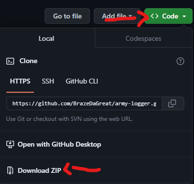

# Army Logger

# Installation

- Download (shown above) and extract.
- Install [Node.js](https://nodejs.org/en).
- Open the root folder.
- Open `install.bat`, this will install all the required dependencies.

Now to run, just open `exec.bat`.

# [Download](https://github.com/BrazeDaGreat/army-logger/releases)
Once a release is out for public, it's released on the Releases page. 
**NOTE**: Minor updates are not released.

# Release History
### 0.16.0 (`2023.07.23`)
- Migrated to `quick.db` (which uses `better-sqlite3` under the hood.)
- All the bugs arising from the database shifting were fixes.
- Changed emails to usernames.